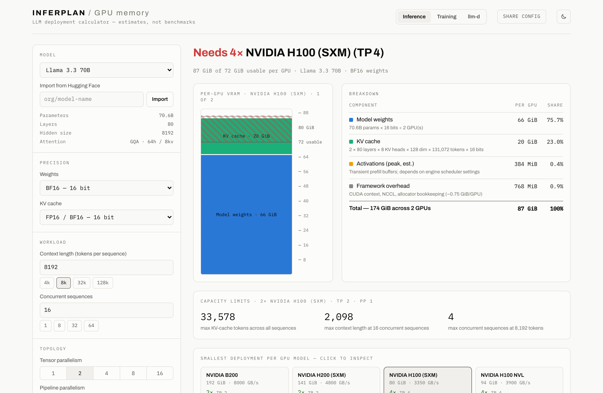

# InferPlan — plan LLM deployments before you buy the GPUs

[](https://github.com/rabrooks/inferplan/actions/workflows/deploy.yml)
[](LICENSE)

**[Try it live → rabrooks.github.io/inferplan](https://rabrooks.github.io/inferplan/)**

Interactive calculators for sizing LLM deployments: how much GPU memory a
model needs, which GPUs it fits on, how far a given cluster can stretch, and
how many GPUs a request rate demands. All calculation runs client-side; the
site is a static build with no backend.

**Inference, training, fine-tuning, and llm-d fleet-sizing scenarios are
live.** All four run on one audited engine: the same primitives that compute
a KV cache also size a disaggregated fleet.

Sister project: [InferLens](https://github.com/rabrooks/inferlens) —
engine-neutral observability for inference engines. **InferPlan predicts what
a deployment needs; InferLens shows what it actually did.** The two meet at
llm-d: InferPlan sizes the prefill/decode pools and emits its predictions in
the exact units InferLens records from each pool (predicted running
requests, KV usage, phase timings), so a trace overlays a plan
number-for-number — the shared contract is
[docs/interop.md](docs/interop.md).


## Features

- **Memory breakdown** — weights, KV cache, activation peak, and framework
  overhead, per GPU, rendered as a VRAM gauge against the selected GPU's
  capacity.
- **Model presets + Hugging Face import** — presets for Llama, Qwen, Mistral,
  Mixtral, DeepSeek, and GPT-OSS, or paste any HF model id to import its
  `config.json`. Exact parameter counts come from the safetensors index when
  available; otherwise they are derived from the architecture (±2%).
- **MoE-aware** — total vs. active parameters are tracked separately, so
  Mixtral/DeepSeek/Qwen-MoE weight memory is computed from all experts.
- **MLA-aware** — DeepSeek-style latent attention uses the compressed KV
  formula, not the GQA one.
- **Quantization** — weight formats from FP32 down to INT3 and GGUF k-quants
  (effective bits include scale/zero-point metadata), with KV-cache precision
  as an independent choice (FP8 KV halves the biggest scaling term).
- **Multi-GPU** — tensor and pipeline parallelism with the real sharding
  rules: head-divisibility checks, KV replication when TP exceeds KV heads.
- **GPU database** — 13 accelerators, B200 through RTX 5090/4090 and
  MI300X/MI325X, each with memory bandwidth and bf16 FLOPS recorded so the
  same entry drives both the VRAM fit and the llm-d throughput/latency
  roofline.
- **Inverse solver** — max context length / max concurrent sequences for a
  given GPU, and the smallest count of every GPU model that serves the config.
- **Training memory** — mixed-precision or FP32 states (AdamW / AdamW 8-bit /
  SGD), ZeRO stages 1–3 (≈ FSDP full-shard at 3) sharded across data-parallel
  ranks, and the Korthikanti et al. activation formula with
  none/selective/full checkpointing. The same inverse solver reports
  activation headroom, max micro-batch, and max sequence length.
- **Fine-tuning modes** — full FT, LoRA, and QLoRA on the same training
  engine: frozen bf16 or NF4 (4-bit, double-quantized) base weights,
  adapter-only gradients/optimizer states from rank × targeted projections,
  and the QLoRA dequant buffer — pinned to the LoRA and QLoRA papers'
  published numbers (65B on a single 48 GB GPU).
- **llm-d fleet sizing** — given a request rate, token lengths, and TTFT/TPOT
  SLOs, sizes the prefill pool (compute roofline + Erlang C queue wait) and
  decode pool (bandwidth roofline + KV-capacity cap) of a disaggregated
  deployment, for any model/GPU pairing in the database — including MoE
  expert-coverage weight traffic and MLA latent KV, which shift both pool
  sizes in ways nothing else computes. Efficiency assumptions (MFU, bandwidth
  efficiency, KV-transfer β) are explicit knobs you can calibrate from a
  measured trace.
- **Shareable URLs** — the entire configuration (including imported custom
  models) is encoded in query params, so a config can be linked in an issue
  or a Slack thread.

## Screenshots

**Fine-tuning** — QLoRA on Llama 3.3 70B, the frozen NF4 base and adapter-only
optimizer states broken out per stratum, with activations (not weights)
dominating the footprint:


**llm-d fleet sizing** — a 100 req/s deployment sized to 500 ms TTFT / 100 ms
TPOT SLOs: prefill and decode pools counted separately, with the queue-wait and
service-time split shown against each SLO tick:


The UI ships a light theme alongside the default dark instrument theme (toggle
in the top-right; follows your OS preference until you choose):



## Quick start

Requires Node 20+ (CI builds on Node 24).

```sh
npm install
npm run dev     # local dev server
npm test        # engine + URL round-trip tests (vitest)
npm run lint    # oxlint
npm run build   # static production build in dist/
```

Stack: Vite + React + TypeScript + Tailwind. The calculation engine
(`src/engine/`) is pure TypeScript with no React imports — it is unit-tested
independently and reusable outside the UI.

## Roadmap

| Scenario | Status |
|----------|--------|
| Inference, single GPU | ✅ shipped |
| Inference, multi-GPU (TP/PP) | ✅ shipped |
| Training (optimizer states, ZeRO/FSDP, activation checkpointing) | ✅ shipped |
| Fine-tuning (full FT, LoRA, QLoRA) | ✅ shipped |
| llm-d multi-pod capacity planning (disaggregated prefill/decode, SLO-driven sizing) | ✅ shipped |

Also planned: comparison mode (side-by-side configs), P99 queue-wait
refinement (v1 ships the M/M/c mean), an `@inferplan/engine` npm package,
cloud cost estimates, and a custom-architecture editor.

## How InferPlan differs

Plenty of VRAM calculators exist; most answer "can I load it," not "can I
serve it" (Hugging Face's own `accelerate estimate-memory` is weights-only).
The polished ones use fixed model dropdowns, skip MoE/MLA, and apply no real
sharding rules. InferPlan's lane:

- **Architecture fidelity** — exact params from the safetensors index, MoE
  total-vs-active accounting, DeepSeek-style MLA latent KV, and the
  KV-replication rule when TP exceeds KV heads.
- **Training and inference in one engine** — the same audited primitives
  compute serving KV cache and ZeRO-sharded optimizer states; no other tool
  unifies the two (training-only prior art:
  [gpu-mem-calculator](https://github.com/George614/gpu-mem-calculator)).
- **Inverse solvers, not just totals** — max context/concurrency for
  inference, max micro-batch/sequence length for training, and the smallest
  deployment of every GPU in the database.
- **An auditable engine** — pure TypeScript, no backend, every formula pinned
  by a test against published numbers ([docs/FORMULAS.md](docs/FORMULAS.md)).
- **Fleet sizing to latency SLOs** — pre-deploy prefill/decode capacity
  planning is a space with essentially no tooling (the research literature
  itself notes the missing methodology); InferPlan sizes both pools of an
  llm-d deployment to TTFT/TPOT targets from spec-sheet physics, with the
  queueing term included and every heuristic exposed as a calibratable knob.
- **A closed loop with observability** — predictions come out in the units a
  live vLLM exposes, so an [InferLens](https://github.com/rabrooks/inferlens)
  trace verifies a plan directly ([docs/interop.md](docs/interop.md)).

## How the numbers are computed

See [docs/FORMULAS.md](docs/FORMULAS.md). Inference estimates target a
vLLM-style serving engine at 90% memory utilization; training estimates
follow transformer-math / Korthikanti et al.; llm-d fleet sizing is a
first-principles roofline (prefill FLOPs/MFU, decode bytes/bandwidth,
Erlang C queueing) pinned against measured prefill and decode numbers from
Meta and the BentoML inference handbook. Activation peaks and efficiency
factors are explicit heuristics — treat totals as ±5% (inference) / ±10%
(training) and fleet sizes as a load-test starting point. This is a
planning tool, not a benchmark.

## Contributing

See [CONTRIBUTING.md](CONTRIBUTING.md) for setup, the project layout, and the
conventions that keep the engine auditable. In short: model presets live in
`src/data/models.ts`, GPUs in `src/data/gpus.ts`, and every formula in
`src/engine/` has a corresponding test in `src/engine/engine.test.ts` pinned
to a published number. PRs that add models/GPUs or tighten a formula against
measured numbers are very welcome. Participation is governed by our
[Code of Conduct](CODE_OF_CONDUCT.md).

## License

[Apache-2.0](LICENSE)
